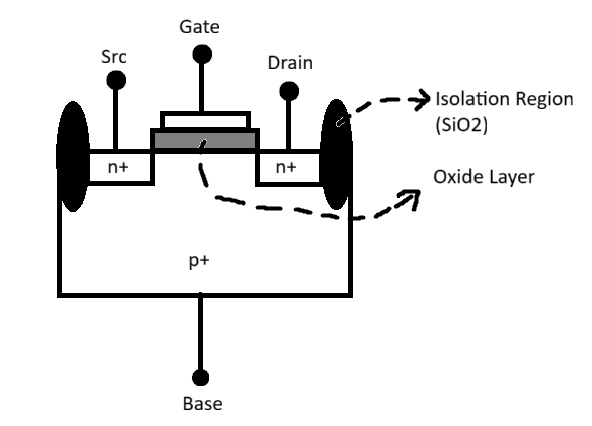
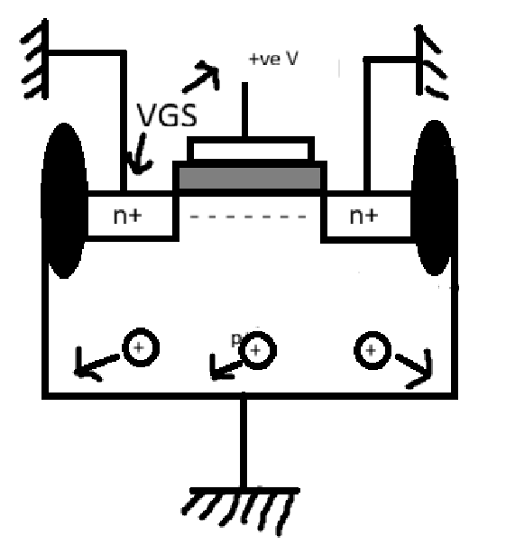

# Introduction to Circuit Design and Spice Simulation 
This document gives you an understanding of circuit design and an introduction to SPICE simulation. It gives a brief decription of NMOS transistor, how threshold voltage `Vth` is calculated with a source-to-bulk voltage `Vsb`, derivation of drain current `Id` in both linear and saturation regions of operation, and how channel length modulation `lambda` affects drain current in saturation region. We also understand what is SPICE simulation, the inputs needed by the SPICE engine to charaterize the circuit and give the required outputs. We go through some example SPICE code, simulate it and observe the output obtained. 

## NMOS Transistor



The image shown in the figure is of a NMOS transitor, which is a MOSFET device that has 4 terminals named, `Gate`, `Source`, `Drain` and `Bulk`. The source and drain terminals are doped with `n+` material and bulk is doped with `p+` material. To avoid electrostatic damage from neighbouring transistors, it also has an `Isolation Region` make of SiO2. The gate is made of a `poly silicon` material which rests on top of a `oxide layer` that acts like an isolator.\

The NMOS transitor can be visualized as a combination of 2 pn junction diodes.


Where in n type material,the strong charge cariers are `electrons` and weak charge carriers are `holes`. In p type material, the strong charge carriers are `holes` and weak charge carriers are `electrons`.

### 1. Threshold Voltage (Vth)
Threshold voltage, often denoted as Vth or VGS, is the minimum gate-to-source voltage required to create a conductive channel between the source and drain of a MOSFET, allowing current to flow through the device and enabling its operation as a switch or amplifier. When the gate voltage is below this threshold, the transistor remains in the cutoff region with no significant current conduction; as the gate voltage exceeds the threshold, a channel forms due to strong inversion of the substrate beneath the gate, and the MOSFET transitions to its active (or linear/saturation) region where current can flow freely. It is one of the most important parameters of a transistor used in SPICE simulation.

#### Understanding Vth
For a device to be on, i.e. for the NMOS transitor to conduct current from drain to source terminal and form a channel for flow of electorns, a minimus voltage must be applied. Let us see what happens when VGS is applied at very little amounts. 


As you can see, when a +ve VGS is applied, the oxide layer has positive charges on the gate side and an electric field is being created which repels the positive charges in the substrate region. Since the elctric field repels the positive charges, it in-turn attracts the weak negative charges present in the p+ substrate. 



Now when we increase the VGS value, a depletion region is formed, the negative charges move closer to the oxide layer such that it becomes a n+ rich region. This phenomenon is called as `Strong Inversion` and the voltage at which strong inversion occurs is called as threshold voltage. 


On further increase of VGS, the gate-oxide surface will start pulling -ve charges from the source terminal, resulting in incrased channel width. This occurs due to the fact that there are no more +ve charges to repel and no more -ve charges to attract from the p+ substrate. Due to channel formation, the source and drain terminals are connected internally allowing charges to flow between them. A very small current is observed in this case.


### 2. Effect of Vsb 
When a voltage source is applied between source and base, we can observe two main differences from the image below


- The width of the depletion region is more when Vsb is applied in comparision to not applying any voltage between source and base. 
- Due to Vsb>0, a few electrons are attracted towards the source terminal.

Now when VGS is further increased, and due to Vsb>0, the channel is not fully inverted. Thus for the device to turn on, we need more VGS as our threshold voltage increases. The channel formed due to this would look somewhat like shown in the below image.


This gives rise to a new variable VTO - which is the initial threshold voltage of the device in absence of Vsb (Vsb=0).


### 3. Regions of Operation
In a MOSFET, there are mainly thress regions of operation - 
- Cut-off
- Linear 
- Saturation 

#### Cut-Off Region
As seen in the previous section, cut-off region is the region where the device is in the `off state` i.e. VGS < Vth. A small amount of current flows between source and drain, but does not affect the device operation much. 

#### Linear Region 
Linear region is observed when the device is in on state i.e. VGS > VTH and also, VDS < VGS - VTH. In this region, the MOSFET acts like a resistor. Also another observable point is that the channel voltage is in a gradient manner, increasing from 0 to VDS. Assuming that the channel voltage is along x axis. For each point the channel voltage will be different because VGS - Vx value is different at that point. 


The drain current for linear region is derived below:
Starting Point: Gradual Channel Approximation. 
- The channel forms between source and drain when gate voltage VGS exceeds threshold Vth.
- The charge density along the channel depends on local voltage V(x), varying from source (at 0 V) to drain (at VDS).


#### Saturation Region 
A MOSFET operates in the saturation region (also called the active region) when the drain-to-source voltage VDS is greater than or equal to the gate overdrive voltage VGS - Vth:
## VDS >= VGS - Vth


The derivation for saturation region is given below 


## SPICE Simulation 
SPICE - Simulation Programming with Integrated Circuit Emphasis 
- Widely used tool for simulating electronic circuits, including MOSFETs and other semiconductor devices.
- SPICE uses mathematical models and device parameters (such as channel length, width, threshold voltage, and transconductance) to predict circuit performance under various conditions.
- Simulations can include DC analysis, transient analysis, AC analysis, and noise analysis, providing insights into voltage, current, and power characteristics.
- Users can define custom device models or use built-in libraries to simulate real-world components, including effects like parasitics and temperature dependence.
- Results from SPICE simulations help verify design functionality, optimize performance, and identify potential issues before fabrication.

### How to write SPICE netlist
- Step 1: Create nodes as shown for the circuit below.


- Step 2: Write netlist code for the above circuit. 

```bash
M1 vdd n1 0 0 nmos W = 1.8u L = 1.2u
R1 in n1 55
VDD Vdd 0 2.5
Vin in 0 2.5
```


