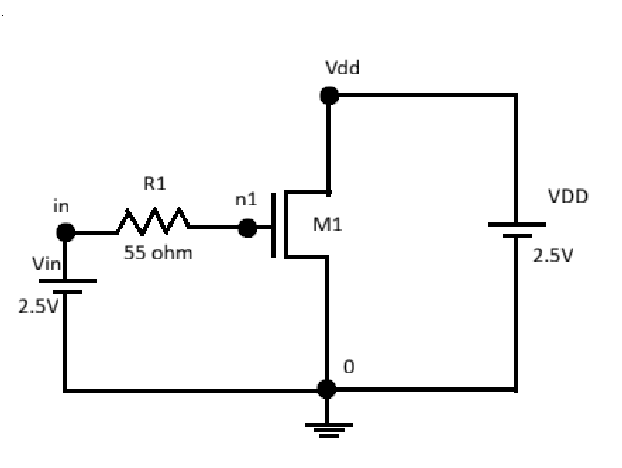
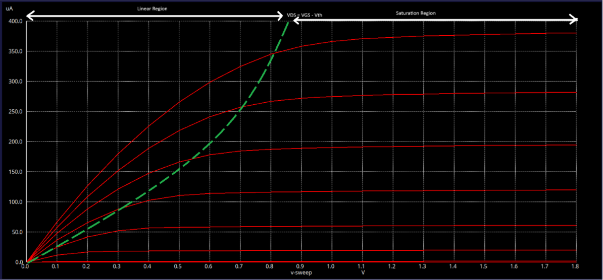
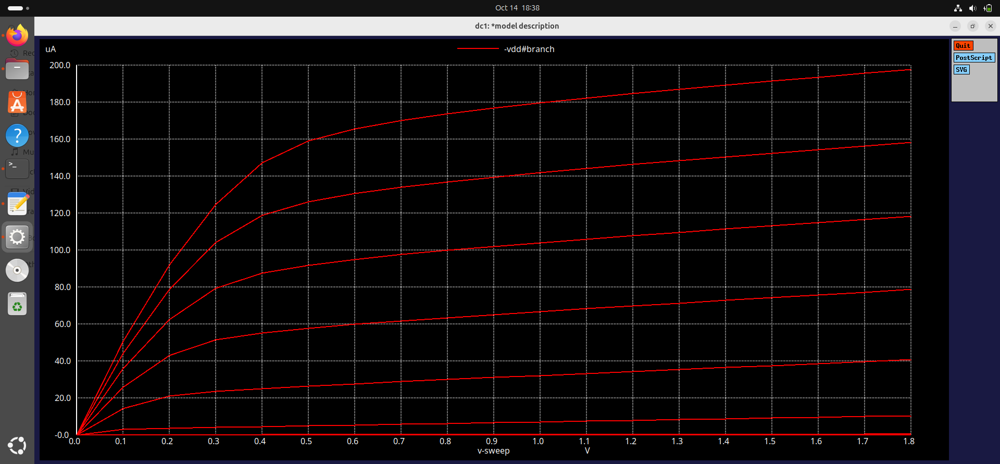
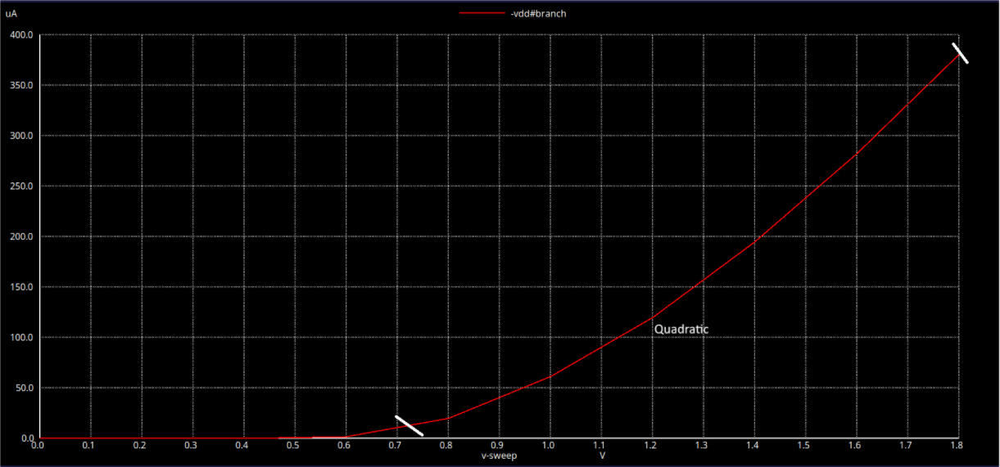
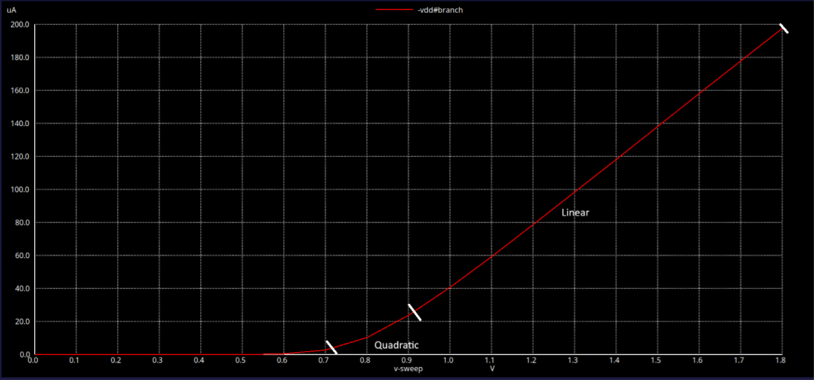
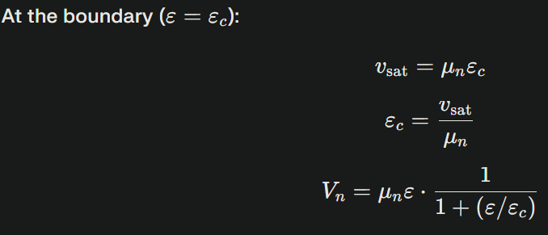
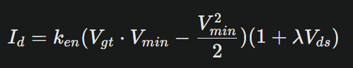
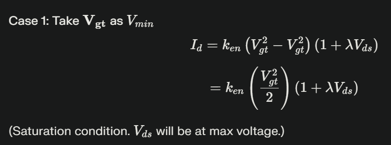
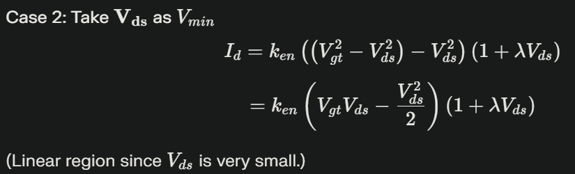
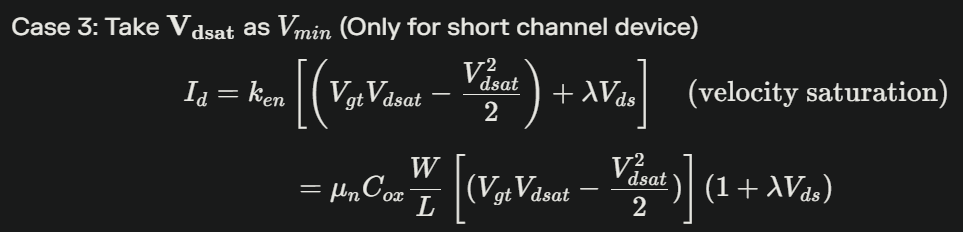

This document gives a brief description on how the drain current `Id` is a function of gate-to-source voltage `VGS` and how the drain current is affected by transistor sizing. It compares the output waveforms obtained from the spice simulation of a long-channel and a short-channel MOSFET. We also discuss how in a short-channel MOSFET, there are four regions of operation and discuss the drain current formula for each. The second part of the document consists of deriving the voltage transfer characteristics (VTC) of a CMOS invertor step by step, while keeping in mind that the main focus of study is characterizing the MOS device as a switch.

# SPICE simulation 
Upon simulation of the circuit shown below - 

The following waveform was obtained 

The below waveform mentions the regions of operation for the same NMOS device simulated, where the green line indicates `Edge of Saturation` that is when VDS = VGS - Vth.

The simulation is performed on a NMOS MOSFET that has characteristics W = 5u and L = 2u (considered as long-channel MOSFET), whose W/L value is 2.5. We are going to compare with another device with same W/L value close to 2.5 but that actual values of W = 0.39u and L = 0.18u. 

**Expectation** Since the W/L values are somewhat simlar, the outputs will be same. 
**Reality** The output waveforms are going to be different and we are going to plot them and make observations do decode this mystery. 

Upon simulation of the same SPICE netlist, but with a short channel MOSFET, the simulation results are are shown below - 

## Observations
### Long Channel MOSFET 
**ID vs VGS for Long Channel MOSFET**

- The drain current `Id` has a quadratic dependence on gate voltage `VGS` 
- The peak saturation current observed is 380 uA. This indicates that saturation happens slower in long-channel devices.

### Short Channel MOSFET 
**ID vs VGS for Short Channel MOSFET**

- The drain current `Id`, initially has a quadratic dependence on gate voltage `VGS` (for lower values of VGS). After the initial point, Id is linear in nature. This is due to velocity saturation.
- The peak saturation current observed is 198 uA. This indicates that saturation happens faster in short-channel devices.

## Velocity Saturation 
The condition where, for lower values of electric field, the velocity tends to be a linear function of electric field but after a certain point, it becomes constant due to scattering effect is called as **Velocity Saturation**. 

The derivation for drain current due to veolocity saturation is given below. We try to derive the equations at boundry condition where ε=εc.

Using these values in the standard drain current equation, we get the following:

The above derived equation is complex in nature, so we try to simplify it in the next section

## Regions of Operation 
As mentioned before, in a short-channel MOSFET, there are 4 regions of operation, Cut-off, Linear, Velocity Saturation and Saturation. 
The cut-off region for both long-channel and short-channel devices are the same as they remain in the off-state (VGS<0). For the remaining regions, we are going to take a model of drain current as shown below:

**We are considering VGS-Vth = Vgt**
Where Vmin = min(Vgt,Vds,Vdsat). Vdsat can be defined as the voltage at which, the device velocity saturates and becomes independent of VGS or Vds. Upon substituting each value as minimum in the above drain current equation, here is what we get

# CMOS Veolocity Transfer Characteristics (VTC)
In this section we are going to look at a MOS device from a switch point of view. A transistor can be called as a switch with inifinite OFF resistance and finite ON resistance. We know that, a MOS transistor is on only when |VGS|>=|Vth| (Considering both NMOS and PMOS device).

## CMOS Inverter 
CMOS - Complementary Metal Oxide Semiconductor, utilizes complementary and symmetrical pairs of p-type and n-type MOSFETs to perform logic functions, resulting in low static power consumption and high noise immunity. 

We will assign a few naming conventions such as -
- VGSp - Voltage between gate and source for PMOS
- VGSn - Voltage between gate and source for NMOS
- VDSp - Voltage between drain and source for PMOS
- VDSn - Voltage between drain and source for NMOS 
- IDSn - Current between drain and source for NMOS
- IDSp - Current between draina and source for PMOS

### Case 1
When Vin is high and equal to Vdd - 
- PMOS is in OFF state
- NMOS is on ON state
- The capacitor discharges and Vout = 0

### Case 2
When Vin is low and equal to 0 -
- PMOS is in ON state
- NMOS is in OFF state
- The capacitor charges and Vout = Vdd

## Observations Made
- VGSn = Vin
- VDSn = Vout
- VGSp = Vin - Vdd
- VDSn = Vout - Vdd
- IDSp = -IDSn 

### ID vs VGS Plots for Transistors 

**Steps to Obtain VTC of Inverter**
VTC is purely a function of voltages, so we convert the above waveforms with values of only Vin and Vout.
#### 1. Finding Load Curve for PMOS 
Assuming the value of Vdd to be 2V and VGSp is from 0V to 2V with a step of 0.5V, we can create the table 

| VGSp         | V            | Vin = VGSp + Vdd    |
| ------------ | ------------ | ------------------- |
| VGSp1        | 0            | 2                   |
| VGSp2        | -0.5         | 1.5                 |
| VGSp3        | -1           | 1                   |
| VGSp4        | -1.5         | 0.5                 |
| VGSp5        | -2           | 0                   |

Here, we have converted the VGSp values in terms of Vin. We are going to do the same for the PMOS waveform too 

Next we are going to convert the x-axis from VDSp to Vout. For that we have to shift the x-axis by a value Vdd. 

The above graph shows the load curve for the PMOS in CMOS inverter. 

#### 2. Finding Load Curve for NMOS
Finding the load curve for a NMOS transistor is a CMOS inverter is simpler that finding for PMOS. We simply replace the values of VGSn with Vin values and x-axis VDSn with Vout. 

| VGSn         | V            | Vin = VGSp + Vdd    |
| ------------ | ------------ | ------------------- |
| VGSn1        | 0            | 0                   |
| VGSn2        | 0.5          | 0.5                 |
| VGSn3        | 1            | 1                   |
| VGSn4        | 1.5          | 1.5                 |
| VGSn5        | 2            | 2                   |

#### 3. Super impose NMOS load curve on PMOS load curve
Now we just have to super impose the NMOS load curve on PMOS load curve and find points of intersection and find the final Vin-Vout waveform. 

| Vin NMOS     | Vin PMOS     | Vout                | NMOS Region of Operation | NMOS Region of Operation|
| ------------ | ------------ | ------------------- | ------------------------ | ----------------------- |
| 2            | 0            | 0                   | Linear                   | Cut-off                 |
| 1.5          | 0.5          | 0<Vout<0.5          | Saturation               | Saturation              |
| 1            | 1            | 0.5<Vout<1          | Saturation               | Saturation              |
| 0.5          | 1.5          | 1<Vout<1.5          | Saturation               | Saturation              |
| 0            | 2            | 2                   | Cut-off                  | Linear                  |

Upon identifying the intersection points, (Vin PMOS, Vin NMOS) where they are similar, we have plotted the following VTC curve. 

Thus we have plotted the VTC plot of a CMOS inverter.

