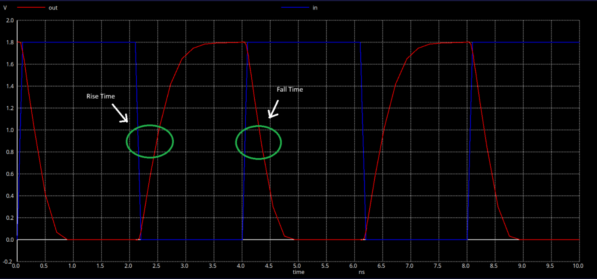
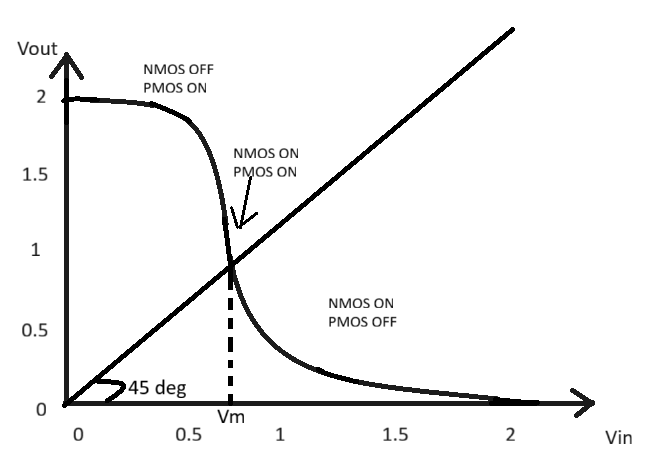
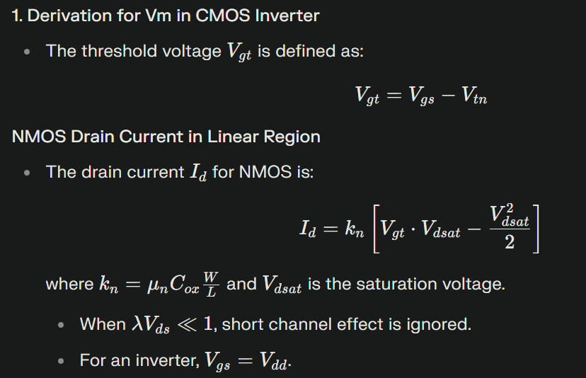
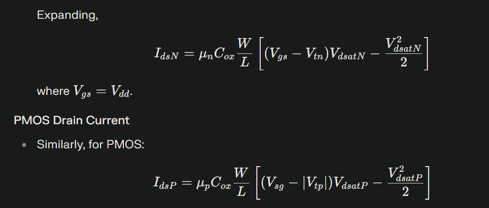
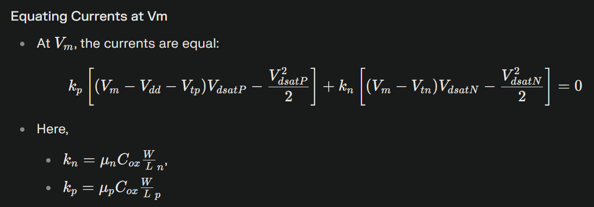
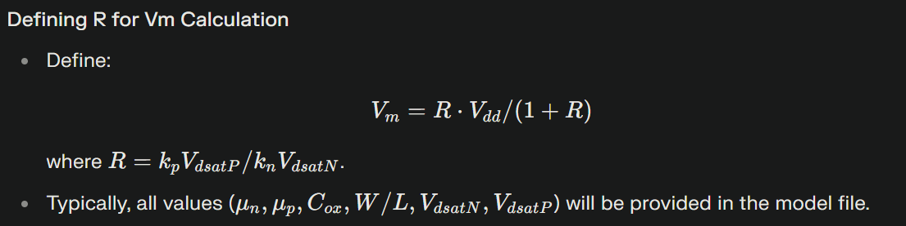
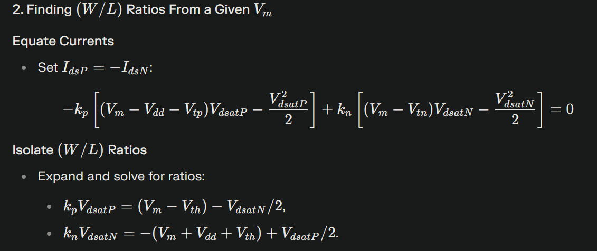
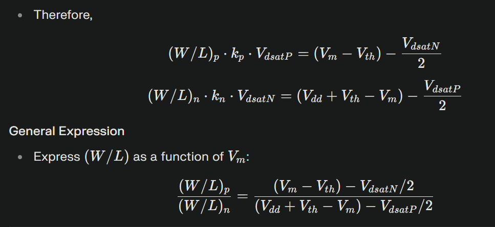

This document will give you a step by step process on how to write a SPCIE deck for a CMOS inverter and perform simulations to obtain the VTC curve and also calculate rise time and fall time from transient simulations.We deepdive into second - order effects like switching threshold (Vm) and derive equations to find Vm as a function of W/L and vice versa. We have also performed transient analysis for CMOS inverters with varrying the width of PMOS transistors as a multiple of NMOS transistors (Wp/Lp=x.Wn/Ln) and compared the resulting rise and fall times, determining which pair is best suited for which application.

# VTC SPICE Simulation
The steps required to perform SPICE simulation to obtain the VTC curve are
- Component connectivity - Connect the components in the right manner. 
- Component values - Give component values like (W/L)n, (W/L)p, Vin, Vdd, Cload ect.
- Identify the nodes - Creating nodes is essential to write SPICE code.
- Name the nodes - Give suitable names to nodes that can be furhter used to write SPICE code. 
- Write the SPICE code - Define the circuit in terms of SPICE code along with the type of simulation that needs to be performed and link the requiered library file.


The SPICE code for the above transistor is given below 


Use this command inside ngspice environment

```bash
plot out vs in
```

The output of DC analysis is a VTC curve as follows


# Calculating Rise and Fall Times
To figure out the rise time and fall time of your output, we perform transient analysis on the same SPICE deck, except change the type of simulation from `.dc` to `.tran`. The Spice code for the same is given below:


Use this command inside the ngspice environment 

```bash 
plot out vs time in
```

This gives you the output waveform as such 


Now, inorder to calculate the rise time and fall times, we going to use the following regions as shown below:


We use the time value of the waveform at exactly 50% of input voltage, for the above transient waveform, we have a 1.8V input voltage. So at 0.9V we find the time values for input and output to be at :


We carry out the same process for fall time and upon doing so, the values of time are:
 

As seen in the above images, it can be observed that the time value at 0.9V for input is 2.1494 ns and output is 2.48233 ns. On subtraction we get 0.33293 ns which is the observed rise time. For fal time we perform the same, it can be seen that at 0.9V for input is 4.05093 ns and output time is 4.33426 ns. On subtracting the two values we get 0.2833 ns as the fall time. 

# Switching Threshold Voltage (Vm)
The switching threshold voltage (often denoted as Vm) in a CMOS inverter is the input voltage level at which the output voltage equals the input voltage. In other words, it is the point where the voltage transfer characteristic (VTC) curve intersects the line Vout=Vin.This voltage signifies the exact switching point of the inverter where the device transitions from a logic high to logic low or vice versa. From a graph, Vm can be plotted by drawing a 45 degree line from origin as shown below. The intersection point of the strain line and the VTC curve tells use the Vm of the inverter. 



For the CMOS inverter that we simulated for VTC waveform, the Vm plotted is shown below. It can be seen that the switching threshold voltage for the design we simulated is approximately 0.87V 


## Derivation of Vm 
The switching threshold can be caluculated using the derivations mentioned below. Prior to the derivation, it is to be kept in mind that at the switching point `VGS = VDS = Vm` and `IDSn = -IDSp` 
### 1. Vm as a function of (W/L)





### 2. (W/L) as a function of Vm 



# Variaton of (W/L)p 
For the simulations in this document we are taking L = 0.15u and are varrying the Wp value as a mutile of Wn. Initially Wn is 0.36u. Upone simulation, the obtained values of Vm, Rise time and Fall time are given in the below table. 

| Wp/Lp        | Wn/Ln        | Vm                  | Rise Time (ns) | Fall Time (ns)   |
| ------------ | ------------ | ------------------- | -------------- | ---------------- |
| Wp/Lp        | 2(Wn/Ln )    | 0.86                | 0.37236        | 0.28334          |
| Wp/Lp        | 3(Wn/Ln )    | 0.88                | 0.26242        | 0.28519          |
| Wp/Lp        | 4(Wn/Ln )    | 0.89                | 0.20198        | 0.28710          |
| Wp/Lp        | 5(Wn/Ln )    | 0.91                | 0.16737        | 0.33824          |

Rise time - The time taken by the capacitor to charge completely.\
Fall time - The time taken by the capacitor to deischarge completely.

From the table with the values obtained from simulation using varried Wp values, it can be observed that the rise time reduces as the size increases and fall time increases as size increases. These variations can be useful in various applications where we want the delay of an inverter or buffer to be more or less. 

But for standard applications the best device is when **rise time = fall time** or approximately equal, as in the case of Wp/Lp = 3(Wn/Ln) from the table. 

With Wp/Lp = 2(Wn/Ln), the delay is more so your signal travels slow. \
With Wp/Lp = 5(Wn/Ln), the delay is significanlty less, allowing the signal to travel faster. 

All these simulation results are obtained by varrying the Wp value in the SPICE file. Keep in mind to verify the available Wp values by checking the library files of the device. 


