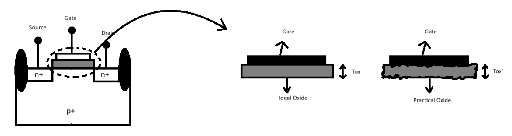

In this document you will get a brief description of how power scalling and device variations are a factor that impact the robustness of a CMOS inverter. We will go through different process variations cause during the fabrication of chips such as W/L ratios, oxide thickness and finding the VTC of CMOS inverter by sweepting an inverter with strong PMOS and weak NMOS to an inverter with strong NMOS and weak PMOS and verifying its robustness.

# Power Scaling 
Power Scaling is another factor that is used to measure the robustness of an inverter. As the node size reduces, the power supplied to the inverter also reduces significantly. To observe this phenomenon we carry out the spice simulation of the given SPICE deck:

Upone siluation of the SPICE netlist in ngspice, the following output is obtained:

The gain of each VTC curve respective to the supply voltage can be calculated where `slope = -1`, the calculated values are present in the table given below.

| Supply Voltage (v)      | Gain |Av|    | Energy (1/2CV^2) (fJ)
| ----------------------- | ------------ | ---------------------|
| 1.8                     | 9.18         | 0.81                 |
| 1.6                     | 9.20         | 0.64                 |
| 1.4                     | 9.19         | 0.49                 | 
| 1.2                     | 10.30        | 0.36                 |
| 1.0                     | 10.13        | 0.25                 |
| 0.8                     | 10.08        | 0.16                 |

## Advantages of Using Low Power Supply
- Significant improvement in the gain. 
- Significant reduction in energy consumed.

## Disadvantages of Using Low Power Supply
- Impact on performance - Takes more time to charge and discharge the capacitor.

# Variations Of Device Processing
A few sources of variations are mentioned below in detail

#### Eteching Process
Etching is an important step in the fabrication process the defines the height and width of a structure. The layout for an inverter is displayed below.

 A visual difference between how an ideal etching outcome in comparision with a more practical etching outcome is shown below. 

To observe how process variations are affected with surrounding components. Let's have a chain of inverters for this explaination as shown.

To make it more interesting, lets look at the layout of the inverter chain as well 

The drain current `Id` is directly proportional to W/L, wich affects delay. 

#### Oxide Thickness

During the fabrication process, the oxide thickness also varires similar to the W/L values. When an inverter is surrounded by inverters, the variation in Tox is not that significant as compared to the variation in oxide thickness of inverters placed in the peripherals caused due to fabrication of different components. 

#### Sweeping W/L values
Another factor that measures robustness of  a CMOS inverter is by sweeping the W/L values. By varrying NMOS and PMOS widths we can observe the shift in Vm and and noise margins. The process is shown below. 

We are performing simulation to obtain VTC curve by varrying width of transistor from strong PMOS to weak PMOS and weak NMOS to strong NMOS. 

